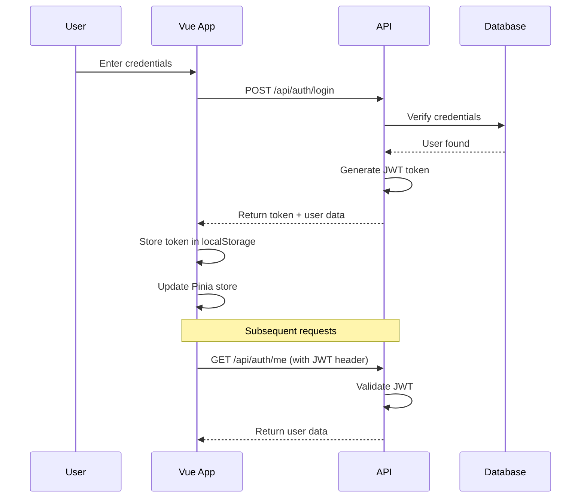

# Knudson Family Construction - Project Management Platform

A complete, production-ready construction project management application built with **.NET 9** and **Vue 3**. Designed for general contractors, subcontractors, and project managers to streamline jobsite coordination, task management, and team collaboration.

## 🚀 Features

- **Project Dashboard**: Real-time overview of active construction projects
- **Team Collaboration**: Secure authentication for contractors, subcontractors, and project managers
- **Role-Based Access Control**: Three user roles (SuperAdmin, Admin, User) with different permissions
- **Task Management**: Create, assign, and track tasks across multiple jobsites
- **Mobile-First Design**: Access from any device - tablet, phone, or desktop
- **Document Management**: Upload and organize project documents, blueprints, and reports
- **Real-Time Updates**: Stay synchronized across the field and office
- **Secure Access**: JWT-based authentication with role-based permissions
- **Modern Tech Stack**: .NET 9 ASP.NET Core + Vue 3 with TypeScript

## 📋 Prerequisites

Before you begin, ensure you have the following installed:

- [.NET 9 SDK](https://dotnet.microsoft.com/download) (version 9.0 or later)
- [Node.js](https://nodejs.org/) (version 18 or later)
- [SQL Server LocalDB](https://learn.microsoft.com/en-us/sql/database-engine/configure-windows/sql-server-express-localdb) or SQL Server
- A code editor (Visual Studio 2022, VS Code, or JetBrains Rider)

## 🏗️ Project Structure

```
/MyApp
├── MyApp.Api/                      # .NET 9 Web API Backend
│   ├── Controllers/                # API Controllers
│   │   └── AuthController.cs       # Authentication endpoints
│   ├── Models/                     # Domain models
│   │   └── User.cs                 # User entity
│   ├── DTOs/                       # Data Transfer Objects
│   │   ├── RegisterRequest.cs
│   │   ├── LoginRequest.cs
│   │   ├── AuthResponse.cs
│   │   ├── UserDto.cs
│   │   └── RefreshTokenRequest.cs
│   ├── Services/                   # Business logic layer
│   │   ├── IAuthService.cs
│   │   ├── AuthService.cs
│   │   ├── ITokenService.cs
│   │   └── TokenService.cs
│   ├── Data/                       # Database context
│   │   └── AppDbContext.cs
│   ├── Program.cs                  # Application entry point
│   ├── appsettings.json           # Configuration
│   └── MyApp.Api.csproj           # Project file
│
├── MyApp.Frontend/                 # Vue 3 Frontend
│   ├── src/
│   │   ├── assets/                 # Static assets
│   │   ├── components/             # Vue components
│   │   │   └── layout/
│   │   │       ├── Header.vue      # Navigation header
│   │   │       └── Footer.vue      # Page footer
│   │   ├── views/                  # Page components
│   │   │   ├── HomeView.vue
│   │   │   ├── LoginView.vue
│   │   │   ├── RegisterView.vue
│   │   │   └── DashboardView.vue
│   │   ├── router/                 # Vue Router config
│   │   │   └── index.ts
│   │   ├── stores/                 # Pinia stores
│   │   │   └── auth.ts             # Auth state management
│   │   ├── services/               # API services
│   │   │   └── api.ts              # Axios configuration
│   │   ├── types/                  # TypeScript types
│   │   │   └── index.ts
│   │   ├── App.vue                 # Root component
│   │   └── main.ts                 # App entry point
│   ├── public/                     # Public assets
│   ├── index.html                  # HTML template
│   ├── vite.config.ts             # Vite configuration
│   ├── tsconfig.json              # TypeScript config
│   └── package.json               # NPM dependencies
│
└── README.md                       # This file
```

## 🔧 Setup Instructions

### 1. Clone the Repository

```powershell
git clone <your-repo-url>
cd MyApp
```

### 2. Backend Setup (.NET API)

#### Install Dependencies

```powershell
cd MyApp.Api
dotnet restore
```

#### Configure Database Connection

Update the connection string in `appsettings.json` if needed:

```json
{
  "ConnectionStrings": {
    "DefaultConnection": "Server=PATRICK\\SQLEXPRESS;Database=KnudsonFamilyConstructionDb;Trusted_Connection=True;MultipleActiveResultSets=true;TrustServerCertificate=True;Encrypt=False"
  }
}
```

**Note**: The default connection string uses `PATRICK\SQLEXPRESS`. Update this to match your SQL Server instance.

#### Apply Database Migrations

The application automatically applies migrations on startup. Alternatively, run manually:

```powershell
dotnet ef migrations add InitialCreate
dotnet ef database update
```

**Default User Accounts** (created automatically on first run):

**SuperAdmin:**
- Email: `seannytheirish@gmail.com`
- Password: `SuperAdmin@123!`
- Role: SuperAdmin (full system access)

**Admin:**
- Email: `knudsonfc@yahoo.com`
- Password: `Admin@123`
- Role: Admin (user management access)

**⚠️ IMPORTANT**: Change these passwords immediately after first login!

#### User Roles

Knudson Family Construction supports three user roles:

- **SuperAdmin**: Full system access, can manage all users and assign any role
- **Admin**: Can manage users (except SuperAdmin accounts), view all projects
- **User**: Standard access, can view and manage assigned projects

#### Run the Backend

```powershell
dotnet run
```

The API will be available at:
- HTTPS: `https://localhost:7000`
- HTTP: `http://localhost:5000`
- Swagger UI: `https://localhost:7000/swagger`

### 3. Frontend Setup (Vue 3)

#### Install Dependencies

```powershell
cd ..\MyApp.Frontend
npm install
```

#### Configure API Endpoint (Optional)

The frontend is configured to proxy API requests to the backend. Update `vite.config.ts` if your backend runs on a different port:

```typescript
server: {
  port: 5173,
  proxy: {
    '/api': {
      target: 'https://localhost:7000',  // Your backend URL
      changeOrigin: true,
      secure: false
    }
  }
}
```

#### Run Development Server

```powershell
npm run dev
```

The frontend will be available at: `http://localhost:5173`

#### Build for Production

```powershell
npm run build
```

This creates an optimized production build in the `dist` folder, which the .NET backend will serve.

## 🌐 API Documentation

### Base URL

```
https://localhost:7000/api
```

### Endpoints

#### 1. Register User

**POST** `/api/auth/register`

Creates a new user account.

**Request Body:**
```json
{
  "email": "user@example.com",
  "password": "SecurePassword123",
  "name": "John Doe"
}
```

**Response (200 OK):**
```json
{
  "token": "eyJhbGciOiJIUzI1NiIs...",
  "refreshToken": "fK8xN2pQ...",
  "user": {
    "id": 1,
    "email": "user@example.com",
    "name": "John Doe",
    "createdAt": "2025-11-18T10:30:00Z"
  }
}
```

**Error Response (400 Bad Request):**
```json
{
  "message": "User with this email already exists"
}
```

---

#### 2. Login

**POST** `/api/auth/login`

Authenticates a user and returns JWT token.

**Request Body:**
```json
{
  "email": "user@example.com",
  "password": "SecurePassword123"
}
```

**Response (200 OK):**
```json
{
  "token": "eyJhbGciOiJIUzI1NiIs...",
  "refreshToken": "fK8xN2pQ...",
  "user": {
    "id": 1,
    "email": "user@example.com",
    "name": "John Doe",
    "createdAt": "2025-11-18T10:30:00Z"
  }
}
```

**Error Response (401 Unauthorized):**
```json
{
  "message": "Invalid email or password"
}
```

---

#### 3. Get Current User

**GET** `/api/auth/me`

Returns the currently authenticated user's information.

**Headers:**
```
Authorization: Bearer <your-jwt-token>
```

**Response (200 OK):**
```json
{
  "id": 1,
  "email": "user@example.com",
  "name": "John Doe",
  "createdAt": "2025-11-18T10:30:00Z"
}
```

**Error Response (401 Unauthorized):**
```json
{
  "message": "Invalid token"
}
```

---

#### 4. Refresh Token

**POST** `/api/auth/refresh`

Generates a new access token using a refresh token.

**Request Body:**
```json
{
  "refreshToken": "fK8xN2pQ..."
}
```

**Response (200 OK):**
```json
{
  "token": "eyJhbGciOiJIUzI1NiIs...",
  "refreshToken": "mL9yO3qR...",
  "user": {
    "id": 1,
    "email": "user@example.com",
    "name": "John Doe",
    "role": "User",
    "createdAt": "2025-11-18T10:30:00Z"
  }
}
```

**Note:** The refresh token endpoint requires database implementation for production use.

---

### Admin Endpoints (Admin & SuperAdmin Only)

#### 1. Get All Users

**GET** `/api/admin/users`

Returns all users in the system (requires Admin or SuperAdmin role).

**Headers:**
```
Authorization: Bearer <your-jwt-token>
```

**Response (200 OK):**
```json
[
  {
    "id": 1,
    "email": "superadmin@buildpro.com",
    "name": "Super Administrator",
    "role": "SuperAdmin",
    "createdAt": "2025-11-18T10:00:00Z"
  },
  {
    "id": 2,
    "email": "user@example.com",
    "name": "John Doe",
    "role": "User",
    "createdAt": "2025-11-18T10:30:00Z"
  }
]
```

---

#### 2. Update User Role

**PUT** `/api/admin/users/role`

Updates a user's role (SuperAdmin role can only be assigned by SuperAdmin).

**Headers:**
```
Authorization: Bearer <your-jwt-token>
```

**Request Body:**
```json
{
  "userId": 2,
  "role": "Admin"
}
```

**Response (200 OK):**
```json
{
  "id": 2,
  "email": "user@example.com",
  "name": "John Doe",
  "role": "Admin",
  "createdAt": "2025-11-18T10:30:00Z"
}
```

**Error Responses:**
- `400 Bad Request`: Invalid role or attempting to change own role
- `403 Forbidden`: Non-SuperAdmin attempting to assign SuperAdmin role
- `404 Not Found`: User not found

---

#### 3. Delete User

**DELETE** `/api/admin/users/{userId}`

Deletes a user (cannot delete own account or SuperAdmin accounts unless you are SuperAdmin).

**Headers:**
```
Authorization: Bearer <your-jwt-token>
```

**Response (200 OK):**
```json
{
  "message": "User deleted successfully"
}
```

**Error Responses:**
- `400 Bad Request`: Attempting to delete own account
- `403 Forbidden`: Non-SuperAdmin attempting to delete SuperAdmin
- `404 Not Found`: User not found

---

#### 4. Get Statistics

**GET** `/api/admin/statistics`

Returns system statistics including user counts by role.

**Headers:**
```
Authorization: Bearer <your-jwt-token>
```

**Response (200 OK):**
```json
{
  "totalUsers": 10,
  "usersByRole": [
    { "role": "SuperAdmin", "count": 1 },
    { "role": "Admin", "count": 2 },
    { "role": "User", "count": 7 }
  ],
  "recentUsers": [
    {
      "id": 10,
      "email": "newest@example.com",
      "name": "New User",
      "role": "User",
      "createdAt": "2025-11-18T15:00:00Z"
    }
  ]
}
```

---

### Interactive API Documentation

Access Swagger UI for interactive API testing:

```
https://localhost:7000/swagger
```

## 🔐 Authentication Flow



### How It Works

1. **Registration/Login**: User submits credentials to the API
2. **Token Generation**: API validates credentials and generates a JWT token
3. **Token Storage**: Frontend stores the token in localStorage and Pinia store
4. **Request Interception**: Axios interceptor automatically adds the token to all API requests
5. **Route Protection**: Vue Router guards check authentication before allowing access to protected routes
6. **Token Validation**: API validates the JWT token on protected endpoints
7. **Automatic Logout**: If token is invalid or expired, user is redirected to login

## 🎨 Frontend Architecture

### State Management (Pinia)

The auth store (`stores/auth.ts`) manages:
- User authentication state
- JWT token storage
- Login/logout operations
- User profile data

### API Service (Axios)

Centralized API client with:
- Automatic JWT token injection
- Request/response interceptors
- Error handling
- Base URL configuration

### Route Guards

Protected routes automatically redirect unauthenticated users to login:

```typescript
{
  path: '/dashboard',
  name: 'dashboard',
  component: DashboardView,
  meta: { requiresAuth: true }  // Requires authentication
}
```

## 🏭 Production Deployment

### Build Frontend

```powershell
cd MyApp.Frontend
npm run build
```

### Configure .NET to Serve SPA

The `Program.cs` is already configured to serve the Vue app from the `wwwroot` folder:

```csharp
app.UseSpa(spa =>
{
    spa.Options.SourcePath = "../MyApp.Frontend";

    if (app.Environment.IsDevelopment())
    {
        spa.UseProxyToSpaDevelopmentServer("http://localhost:5173");
    }
});
```

### Deploy to Production

1. Build both projects:
   ```powershell
   cd MyApp.Frontend
   npm run build
   
   cd ..\MyApp.Api
   dotnet publish -c Release -o ./publish
   ```

2. Copy the Vue build output to `wwwroot`:
   ```powershell
   xcopy /E /I MyApp.Frontend\dist MyApp.Api\wwwroot
   ```

3. Deploy the `publish` folder to your hosting environment (Azure, IIS, Docker, etc.)

## 🔒 Security Considerations

- **Password Hashing**: BCrypt with automatic salt generation
- **JWT Secret**: Change the `JwtSettings:SecretKey` in production (minimum 32 characters)
- **HTTPS**: Always use HTTPS in production
- **CORS**: Configure CORS policy for your production domain
- **SQL Injection**: Protected by Entity Framework Core parameterized queries
- **XSS**: Vue 3 automatically escapes user input
- **Token Expiry**: JWT tokens expire after 60 minutes (configurable)

### Important: Update Secrets for Production

```json
{
  "JwtSettings": {
    "SecretKey": "CHANGE-THIS-TO-A-STRONG-SECRET-KEY-IN-PRODUCTION",
    "Issuer": "YourProductionDomain.com",
    "Audience": "YourProductionDomain.com"
  }
}
```

## 🧪 Testing

### Backend Tests

```powershell
cd MyApp.Api
dotnet test
```

### Frontend Tests

```powershell
cd MyApp.Frontend
npm run test
```

## 📦 Technologies Used

### Backend
- **.NET 9** - Modern, high-performance framework
- **ASP.NET Core Web API** - RESTful API framework
- **Entity Framework Core** - ORM for database access
- **SQL Server** - Relational database
- **JWT Bearer Authentication** - Secure token-based auth
- **BCrypt.Net** - Password hashing
- **Swagger/OpenAPI** - API documentation

### Frontend
- **Vue 3** - Progressive JavaScript framework
- **TypeScript** - Type-safe JavaScript
- **Vite** - Next-generation frontend tooling
- **Vue Router** - Client-side routing
- **Pinia** - State management
- **Axios** - HTTP client
- **Bootstrap 5** - CSS framework
- **Bootstrap Icons** - Icon library

## 🐛 Troubleshooting

### Database Connection Issues

If you encounter database connection errors:

1. Ensure SQL Server LocalDB is installed
2. Update the connection string in `appsettings.json`
3. Run migrations manually:
   ```powershell
   dotnet ef database update
   ```

### CORS Errors

If you see CORS errors in the browser console:

1. Verify the frontend URL is in the CORS policy in `Program.cs`
2. Ensure the backend is running on the expected port

### Build Errors

If npm install fails:

1. Delete `node_modules` and `package-lock.json`
2. Run `npm install` again
3. Ensure Node.js version is 18 or higher

## 📝 License

This project is licensed under the MIT License.

## 👥 Contributing

Contributions are welcome! Please follow these steps:

1. Fork the repository
2. Create a feature branch (`git checkout -b feature/AmazingFeature`)
3. Commit your changes (`git commit -m 'Add some AmazingFeature'`)
4. Push to the branch (`git push origin feature/AmazingFeature`)
5. Open a Pull Request

## 📧 Contact

For questions or support, please open an issue on GitHub.

---

**Built with ❤️ using .NET 9 and Vue 3**
